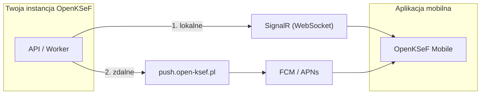

# Powiadomienia push

Powiadomienia push informują aplikację mobilną o nowych fakturach z KSeF.

## Jak to działa

| Warstwa | Kiedy działa | Konfiguracja |
|---------|--------------|--------------|
| **SignalR** | Aplikacja jest połączona z serwerem | Brak -- zawsze włączone |
| **Relay** | Aplikacja w tle | Wybierz w kreatorze (domyślnie) |
| **Email** | Zawsze | Skonfiguruj SMTP |

Większość instalacji potrzebuje tylko **SignalR + Relay**. Nie wymaga to konfiguracji Firebase.

## Konfiguracja

W [kreatorze konfiguracji](admin-setup) (Krok 5 -- Integracje):

- **Relay OpenKSeF** (domyślna) -- URL `https://push.open-ksef.pl` jest uzupełniony automatycznie. Instancja rejestruje się automatycznie i otrzymuje unikalny klucz API. Gotowe.
- **Własny Firebase** -- wklej JSON service account. Szczegóły w [Firebase Console](https://console.firebase.google.com/) > Project Settings > Service Accounts > Generate new private key.
- **Tylko lokalne** -- brak zdalnych push, tylko SignalR gdy aplikacja jest aktywna.

## Bezpieczeństwo

Komunikacja z relay jest zabezpieczona trzema warstwami:

1. **Cloudflare** -- HTTPS, rate limiting, ochrona przed botami
2. **Rejestracja instancji** -- każda instancja ma unikalny klucz HMAC (generowany automatycznie przy konfiguracji)
3. **Walidacja żądań** -- podpis HMAC, sprawdzenie aktualności timestamp (5 min), limit żądań per instancja

Żadne klucze nie są zapisane w kodzie źródłowym -- generowane przy rejestracji i przechowywane w bazie danych instancji.

## Testowanie

1. Zaloguj się do portalu > **Urządzenia**
2. Znajdź zarejestrowane urządzenie > **Testuj**

## Rozwiązywanie problemów

| Objaw | Rozwiązanie |
|-------|-------------|
| Brak powiadomień | Włącz relay w kreatorze |
| SignalR nie łączy | Zaloguj się ponownie w aplikacji |
| Relay zwraca 401 | Instancja niezarejestrowana -- przejdź do Ustawienia > Powiadomienia push > Zarejestruj ponownie |
| Relay zwraca 403 | Instancja wyłączona przez administratora relay |
| Relay zwraca 429 | Przekroczono limit żądań |
| Relay zwraca 502 | Problem z Firebase/APNs po stronie relay |
