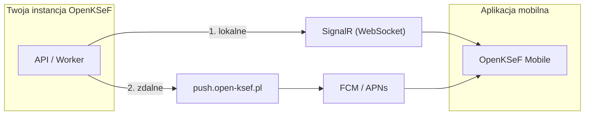

# Powiadomienia push

Powiadomienia push informują aplikację mobilną o nowych fakturach z KSeF.

## Jak to działa

| Warstwa | Kiedy działa | Konfiguracja |
|---------|--------------|--------------|
| **SignalR** | Aplikacja jest połączona z serwerem | Brak -- zawsze włączone |
| **Relay** | Aplikacja w tle | Wybierz w kreatorze (domyślnie) |
| **Email** | Zawsze | Skonfiguruj SMTP |

Większość instalacji potrzebuje tylko **SignalR + Relay**. Nie wymaga to konfiguracji Firebase.

## Konfiguracja

W [kreatorze konfiguracji](admin-setup) (Krok 5 -- Integracje):

- **Relay OpenKSeF** (domyślna) -- URL `https://push.open-ksef.pl` jest uzupełniony automatycznie. Gotowe.
- **Własny Firebase** -- wklej JSON service account. Szczegóły w [Firebase Console](https://console.firebase.google.com/) > Project Settings > Service Accounts > Generate new private key.
- **Tylko lokalne** -- brak zdalnych push, tylko SignalR gdy aplikacja jest aktywna.

## Testowanie

1. Zaloguj się do portalu > **Urządzenia**
2. Znajdź zarejestrowane urządzenie > **Testuj**

## Rozwiązywanie problemów

| Objaw | Rozwiązanie |
|-------|-------------|
| Brak powiadomień | Włącz relay w kreatorze |
| SignalR nie łączy | Zaloguj się ponownie w aplikacji |
| Relay zwraca 401 | Sprawdź klucz API relay |
| Relay zwraca 502 | Sprawdź logi relay / dane Firebase |
