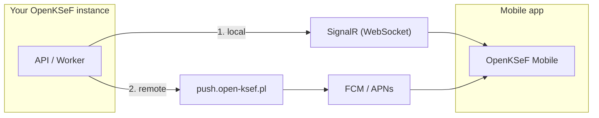

# Push notifications

Push notifications alert the mobile app about new invoices from KSeF.

## How it works

| Layer | When it works | Configuration |
|-------|---------------|---------------|
| **SignalR** | App is connected to the server | None -- always enabled |
| **Relay** | App in background | Select in wizard (default) |
| **Email** | Always | Configure SMTP |

Most installations need only **SignalR + Relay**. No Firebase setup required.

## Configuration

In the [setup wizard](admin-setup) (Step 5 -- Integrations):

- **OpenKSeF Relay** (default) -- URL `https://push.open-ksef.pl` is pre-filled. Done.
- **Own Firebase** -- paste the service account JSON. Details at [Firebase Console](https://console.firebase.google.com/) > Project Settings > Service Accounts > Generate new private key.
- **Local only** -- no remote push, SignalR only when the app is active.

## Testing

1. Log in to the portal > **Devices**
2. Find a registered device > **Test**

## Troubleshooting

| Symptom | Solution |
|---------|----------|
| No notifications | Enable relay in the wizard |
| SignalR won't connect | Log in again in the app |
| Relay returns 401 | Check the relay API key |
| Relay returns 502 | Check relay logs / Firebase credentials |
